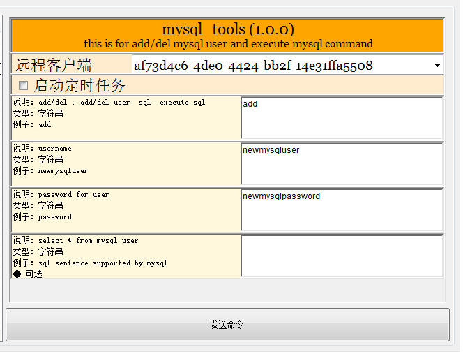
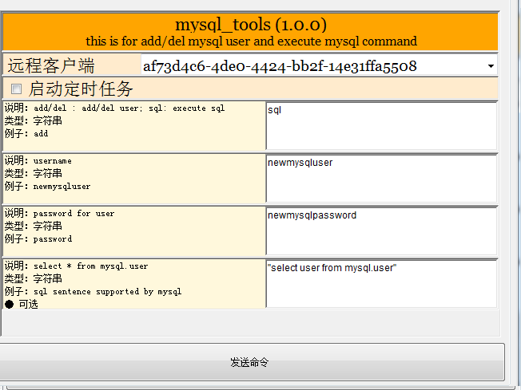

# UI控制端使用手册

## 部署
 [UI可执行文件](../../bin/TrojanCommandSender.exe)及其[依赖](../../bin/Mysql.data.dll)
 拷贝至server.exe同级目录下，另外将[client_tools](client_tools)下编译出的标准命令放入command目录下，
 目录结构及文件如下：
 ```
 D:\server>tree /F
 卷 DATA 的文件夹 PATH 列表
 卷序列号为 000E-DA07
 D:.
 │  config.json
 │  MySql.Data.dll
 │  server.exe
 │  TrojanCommandSender.exe
 │
 └─command
         client_info.exe
         mysql_tools.exe
         run_bat.exe
         scan_dir.exe
         scan_dir.zip


 D:\server>
 ```
 双击执行TrojanCommandSender.exe，效果如下：


## UI分区功能介绍
按照功能将UI分为4个区域，分别为一至四区，
* 一区显示受控端列表，每项分别为唯一编号及IP
* 二区是主要功能列表，包括命令发送与上传下载
* 三区根据二区内容决定
* 四区主要是调试日志查看

如图：


## 执行标准命令
上图分区中的二区里的命令发送，表示将对应的命令发送至受控端执行，
左侧的命令列表区，显示可以运行的标准命令，这些文件来自于command目录，右侧的区域表示
组装命令的参数，其中参数的解释由具体的命令--help以json格式给出，如`mysql_tools.exe --help`
得到如下json

```
D:\server>command\mysql_tools.exe --help
{
  "name": "mysql_tools",
  "version": "1.0.0",
  "desc": "this is for add/del mysql user and execute mysql command",
  "Parameters": [
   {
    "long_fmt": "-c",
    "short_fmt": "-c",
    "example": "add",
    "desc": "add/del : add/del user; sql: execute sql",
    "required": true,
    "type": "string"
   },
   {
    "long_fmt": "-u",
    "short_fmt": "-u",
    "example": "newmysqluser",
    "desc": "username",
    "required": true,
    "type": "string"
   },
   {
    "long_fmt": "-p",
    "short_fmt": "-p",
    "example": "password",
    "desc": "password for user",
    "required": true,
    "type": "string"
   },
   {
    "long_fmt": "-s",
    "short_fmt": "-s",
    "example": "sql sentence supported by mysql",
    "desc": "select * from mysql.user",
    "required": false,
    "type": "string"
   }
  ]
 }

D:\server>
```
界面点击mysql_tools展示如图：


其中右侧区上部分设置将运行的受控端，下半部分组装命令需要的参数，其中每个参数
的左侧`说明，类型，例子`，可以指导参数应该如何设置，其中一个mysql_tools.exe添加
用户的例子如图：



点击发送命令，命令将被发送到如图所示的`af73d4c6-4de0-4424-bb2f-14e31ffa5508`机器上执行，

执行完成后，结果回传至data/command/
```
D:\server>tree /F
├─data
│  └─command
│      └─af73d4c6-4de0-4424-bb2f-14e31ffa5508
│              135_20180405-14-30-00.txt

D:\server>

```

对比观察可以发现，多了如上文件，此文件内容是在受控端执行的打印结果：

```
{
 "cmd_string": "create user",
 "user": "newmysqluser",
 "pass": "newmysqlpassword"
}
[
    {
      "stderr": "[]",
      "stdout": "[]"
    }
]
```

继续下发查询命令：



得到结果：

```

{
 "cmd_string": "run_sql",
 "user": "newmysqluser",
 "pass": "newmysqlpassword",
 "sql": "select user from mysql.user"
}
[
    {
      "user": "mysql.session"
    },
    {
      "user": "newmysqluser"
    },
    {
      "user": "root"
    }
    {
      "stderr": "[mysql: [Warning] Using a password on the command line interface can be insecure.]",
      "stdout": "[]"
    }
  ]
```

说明新增用户成功，并且能够使用新增的用户名密码在mysql.user表中查到自己。

这里仅举mysql_tools一例，其他命令有各自的用法，并且这里的命令是可扩展的，只要--help

满足对应的json格式，同时能够接受json里描述的参数，则可以被UI接受，这个过程在此项目上

被称为命令`标准化`，现在已经实现的标准化命令如下：

* mysql_tools 新增/删除mysql，执行mysql语句
* scan_dir 按照层数扫描磁盘文件
* cat 查看文本文件内容
* antivir_exec 在麻醉掉safedogguardcenter的情况下执行命令
* run_bat 执行bat/powershell/内置windows命令
* client_info 查看受控端服务的安装路径，及已经保存的标准命令路径

如遇到其他特殊需求，将命令标准化并放入command目录下，则可以在受控端运行，

系统用此机制保证功能可扩展。

## 文件传输
文件传输分为受控端->服务器，服务器->受控端，如图


注意：
* 左侧为本地路径，右侧为受控端路径，这里只支持单个文件传输，文件夹传输可以通过扩展标准命令，打包实现。
* 安全起见，文件不会替换，当文件已经存在，需要通过标准命令run_bat进一步执行内置move命令覆盖已有文件。

## 常见问题

* 待续